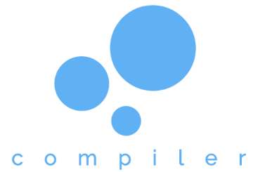

## Compiler
Create a custom language with specialized syntax and with custom libraries in minutes. Automatically creates an editor with code-running abilities, compiling with Python.
### Installation
Download the latest version of the Compiler.app.zip file in the app folder of this repository. Unzip the application, and open it.
###### OR
In the terminal, write:
```
$ git clone https://github.com/underpig1/Compiler
```
and unzip and open the Compiler.app.zip file in the app folder.
### Use
Answer the questions in the application to create your own custom language. Create a standard library for you, written in your language or in Python. If spaces are desired after declarations (int[ ]i = 0;), add spaces to your answers(int[ ]). Once the language is constructed, the IDE can be accessed in the newly-created folder titled Compile_LanguageName. Double-click the launch.command file, or write into your terminal:
```
$ ./Users/user/Desktop/Compile_LanguageName/launch.command
```
#### Question Reference
Refer to this guide if you are unsure of what any as to what the questions intend.

Term | Definition
---- | ----
Name of Language: | The name of your language to create.
Variable Integer: | The keyword to declare an integer: [int ]
Variable String: | The keyword to declare a string: [str ]
Variable Float: | The keyword to declare a floating point (decimal): [float ]
Variable Array: | The keyword to declare an array or list: [list ]
Variable Dictionary: | The keyword to declare a dictionary: [dict ]
Function Declaration: | The keyword to declare a function: [def ]
Class Declaration: | The keyword to declare a function: [class ]
Line Ending: | The character to declare an end of a line: [;]
Setting of Variable: | An example of setting an integer, string, or float: [int i = 0;]
Array or Dictionary Parser: | The character used to seperate list or dictionary items when initializing them: [,]
Parameter Parser: | The character used to seperate parameter items: [,]
Setting of Variable Array and Dictionary: | An example of setting a dictionary or list: [list i = (0, 0);, dict i = {0:0, 0:0}]
Setting of Function: | An example of declaring a function: [list i = (0, 0);, dict i = {0:0, 0:0}]
Dictionary Value Declaration Character: | The character to set the value of any dictionary key: [:]
Index Closings and Openings: | The character to declare the start and end of an index of a dictionary or list: [], []
Parameter Closings and Openings: | The character to declare the start and end of a parameter input: [), (]
Container Closings and Openings: | The character to declare the start and end of a loop, function, or class: [}, {]
Inheritance Closings and Openings: | The character to declare the start and end of an inheritance statement: [), (]
Index Splice: | The character to declare a splicing when indexing: [:]
Return: | The function to return a variable in an outer function: [return]
Comments: | The character to declare a comment: [#]
Logical Operators: | The conditional statements: [===, ==, !=, >, <, >=, <=, &&, ||]
Expressions: | The mathematical operators: [+, -, /, *, **, %]
Self Expressions: | The mathematical operators on a variable: [+=, -=, /=, *=]
Break Statement: | The break statement: [break]
Continue Statement: | The restart statement: [continue]
Property Keyword: | The keyword to declare private variables: [this]
Variable and Function Access Characters: | The character to access private variables and to call private functions: [.]
Call Keywords: | The keywords to call classes and functions: [new]
Initialization and Destruction Functions: | The class functions to call when the class is initialized or destroyed: [__init__, __del__]
Import Prefix: | The import function: [import]
Pass Statement: | The pass statement: [pass]
Global Variable Declaration Keyword: | The keyword to declare a global variable: [global]

### Troubleshooting
#### I can't open the IDE
Type this into your terminal:
```
$ cd /Users/user/Desktop/Compile_LanguageName
$ chmod +x launch.command
$ open launch.command
```
Be sure to modify the directory to include your user's name and the name of your language where it has them.
#### I can't open the Compiler app
You must have Python 3.0 or higher installed on your device.
To install with Homebrew:
```
$ brew install python3
```
